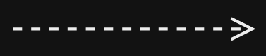
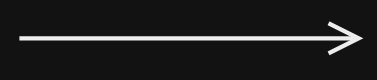
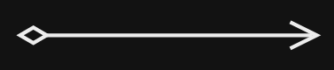
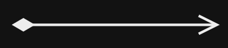
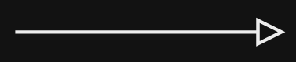

### Concetto e Struttura

Lo scopo del **diagramma delle classi** [[UML]] è fornire una vista statica del sw (una sorta di snapshot, fotografia) tramite la rappresentazione delle sue classi, corredate di metodi, attributi e relazioni.

I componenti identificabili in un diagramma delle classi sono:
- **oggetti** (_Classi_ e _Interfacce_), rispettivamente riconoscibili per le lettere “C” e “I” nella parte superiore di ogni blocco. Esiste anche il marcatore "A", che rappresenta una classe astratta. Inoltre, per i diagrammi UML relativi a Java si può usare la lettera "E" per rappresentare le classi `enum`;
  []
  []
- **metodi**: preceduti da un cerchio e dal tipo di valore restituito;
  []
- **attributi**: preceduti da un quadrato, corrispondono agli attributi dell’oggetto;
  []
- **relazioni**: **frecce** che connettono oggetti.

È possibile rappresentare il _cerchio_ dei metodi e il quadrato degli attributi con colori diversi in base alla visibilità. In Java, ad esempio, si può usare il verde per la visibilità `public`, l'arancione per `protected` e il rosso per `private`.

Valgono anche due regole sintattiche generali:
- se una scritta è in _corsivo_ vuol dire che all’elemento corrispondente manca qualche definizione ed è da considerarsi **astratto**;
- se una scritta è <u>sottolineata</u> vuol dire che l’elemento corrispondente (tipicamente metodo o attributo) è **statico**, ovvero ha una visibilità a livello di classe e non a livello di istanza (cioè è possibile riferirsi a esso anche senza avere precedentemente istanziato la classe);
- se è incluso tra << >> allora si tratta di uno **stereotipo**, ovvero un nuovo elemento introdotto, può essere un attributo o un’interfaccia ad esempio, per questo specifico _use-case_ che permette di estendere UML.

## Relazioni

Nel diagramma delle classi UML esistono relazioni di diversi tipi. Ogni relazione viene rappresentata tramite una **specifica forma di freccia**:
### Dipendenza

Dipendenza semantica, i cambiamenti di uno potrebbero riflettersi sull'altro.

_Una relazione generica tra due classi (in modo semantico)._

Si tratta di una relazione tra classi. Si legge: *"la classe A è in relazione di dipendenza con la classe B".*
Indica che la classe A dipende dal codice della classe B. Vale a dire che se cambiassi il codice della classe B potrei dover modificare di conseguenza anche il codice della classe A.
### Associazione

Rappresenta una famiglia di collegamenti strutturali.

_Una o entrambe le classi hanno una reference all'altra._

Si tratta di una relazione tra istanze. Si legge: *"una istanza della class A è in relazione di associazione con x istanze della classe B"*. Indica che la classe A è in relazione (interagisce) con istanze della classe B che conosce (e di cui tiene memoria, comunemente tramite un attributo della classe).
Esempio: un professore è in relazione di associazione (RELATORE_DI) con studenti (ad esempio con i suoi tesisti, che conosce e di cui ha memorizzato nomi e indirizzi email).

### Aggregazione

Contenitore, contiene una o più istanze di un'altra classe.

Variante più specifica dell'associazione, contiene 1 o N istanze di una classe.
Dunque questa relazione non è più tra classi, bensì tra _istanze_ delle classi.

_Lato rombo: contenitore, lato freccia: contenuto, classe delle istanze._

Esempio: un deck contiene tante carte (da 0 a 52 carte), che però possono esistere da sole.

### Composizione

Forma più forte di aggregazione, dove il contenitore controlla il life cycle dei contenuti. 
Viene utilizzata quando si hanno degli elementi che sono _fisicamente_ collegati tra loro (non solo virtualmente come nel caso delle carte). **Senza l’uno l’altro non può vivere e viceversa**.

_Lato rombo: contenitore, lato freccia: contenuto, classe delle istanze._

Esempi:
- un palazzo è composto da tanti appartamenti, distruggendo il palazzo un appartamento da solo non ha senso di esistere.
- la rappresentazione del concetto di _aereo_: senza il _motore_ l’aereo non può esistere, poiché il primo è un oggetto indispensabile per funzionamento del secondo. Specularmente, non accadrà mai che il motore passi a un altro aereo (a differenza delle carte che possono passare a più mani).

> [!NOTE] Nota bene
> Nel caso di **associazione, aggregazione e composizione** se non si mette la freccia vuol dire che la relazione è percorribile (navigabile) nei due sensi

### Realizzazione o Implementazione

Implementazione di un'interfaccia.

### Estensione / Generalizzazione

Estensione di una classe concreta/astratta.

